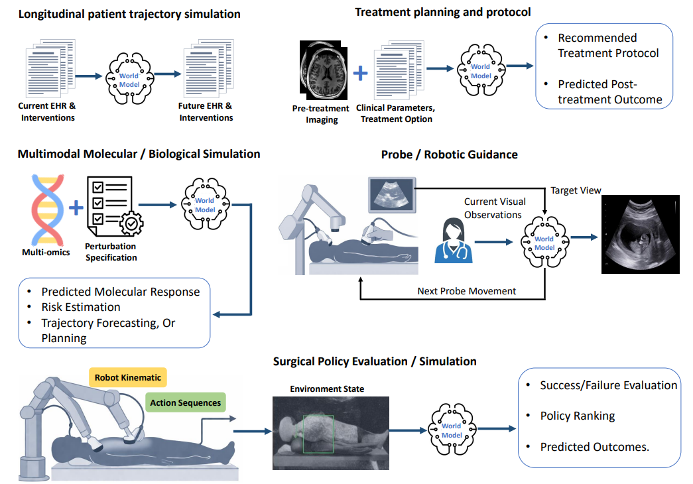
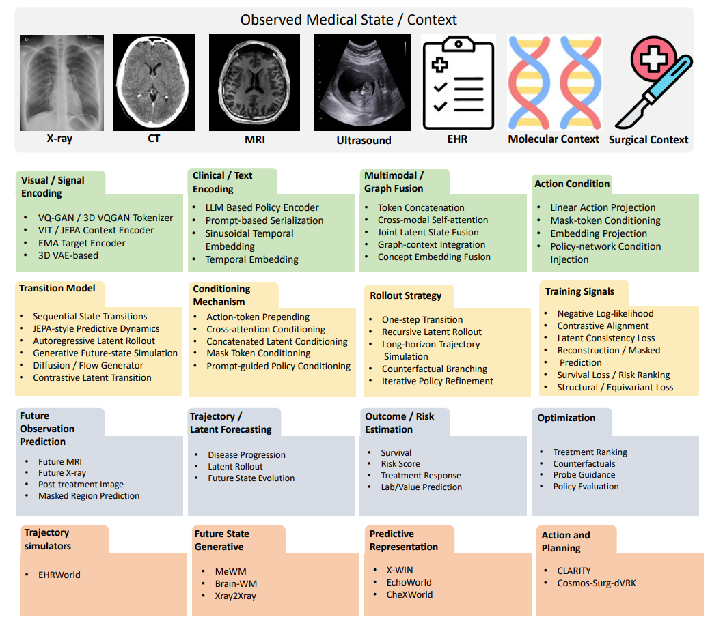
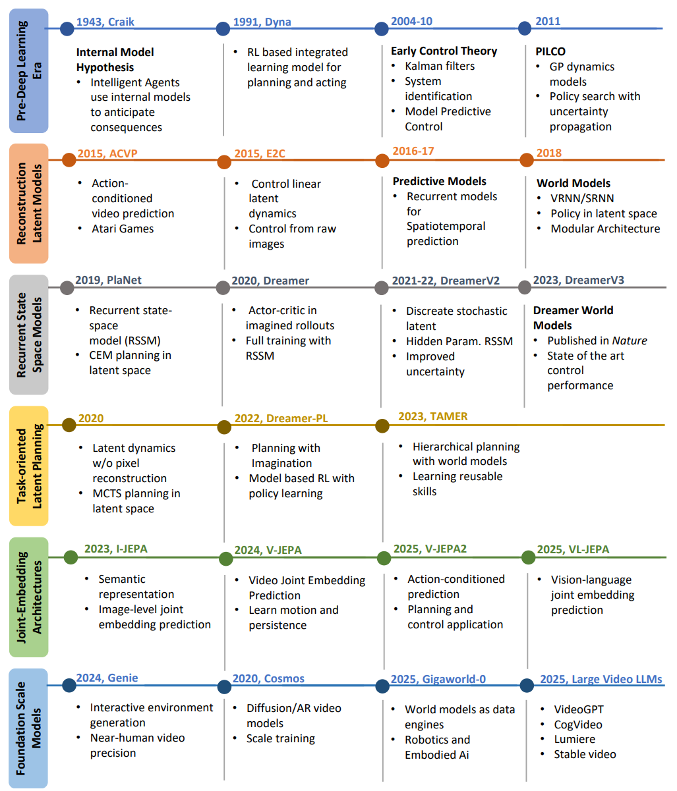

# 🧠 Awesome Medical World Models

[](https://awesome.re)


A curated, clinically organized list of **world models for medical artificial intelligence**: medical imaging, electronic health records, treatment planning, ultrasound guidance, surgical robotics, and virtual-cell / biological simulation.

This repository is designed as a **one-stop research map** for people building predictive, action-conditioned, counterfactual, and planning-oriented medical AI systems.

<p align="center">
  
</p>

---

## 🚩 News & Updates

- **[2026-06] Initial release.** Medical world-model papers organized by clinical application.
- **[2026-06] Verified links added.** Paper, project, code, and dataset links were checked manually during repository creation.
- **[Ongoing] Contributions welcome.** Add missing papers, code, datasets, benchmarks, or corrected links through a pull request.

---

## 📌 Table of Contents

- [🎯 Aim of the Project](#-aim-of-the-project)
- [🧭 What Is a Medical World Model?](#-what-is-a-medical-world-model)
- [🗺️ Taxonomy](#️-taxonomy)
- [📖 Surveys, Reviews, and Position Papers](#-surveys-reviews-and-position-papers)
- [🏛️ Foundational World Model Papers](#️-foundational-world-model-papers)
- [🧠 Medical Imaging World Models](#-medical-imaging-world-models)
- [🏥 EHR and Clinical Trajectory World Models](#-ehr-and-clinical-trajectory-world-models)
- [💊 Treatment Planning and Counterfactual Decision Support](#-treatment-planning-and-counterfactual-decision-support)
- [🫀 Ultrasound and Probe Guidance World Models](#-ultrasound-and-probe-guidance-world-models)
- [🤖 Surgical and Robotic Medical World Models](#-surgical-and-robotic-medical-world-models)
- [🧬 Molecular, Biological, and Virtual Cell World Models](#-molecular-biological-and-virtual-cell-world-models)
- [📊 Datasets and Benchmarks](#-datasets-and-benchmarks)
- [🧪 Evaluation Metrics](#-evaluation-metrics)
- [🛠️ Repository Files](#️-repository-files)
- [🤝 Contributing](#-contributing)
- [📝 Citation](#-citation)

---

## 🎯 Aim of the Project

Medical AI is moving from static prediction toward **simulation of future medical states under actions and interventions**. This repository organizes that emerging direction.

It aims to:

- map the medical world-model literature into clinically meaningful categories;
- make paper, project, code, dataset, and benchmark links easy to find;
- distinguish representation learning from intervention-aware simulation and planning;
- highlight reproducible resources for medical imaging, EHR modeling, ultrasound, surgery, and virtual cells;
- help researchers identify open problems in safety, uncertainty, causality, and clinical validation.

---

## 🧭 What Is a Medical World Model?

A **medical world model** is a predictive model that learns a structured representation of a medical system and simulates how that system may evolve over time, often conditioned on **clinical actions**, **treatments**, **robotic motions**, or **biological perturbations**.

Typical inputs include:

- X-ray, CT, MRI, ultrasound, pathology, or surgical video;
- EHR events, diagnoses, medications, lab values, procedures, and notes;
- molecular profiles, perturbation descriptions, omics context, and biological knowledge graphs;
- clinical or physical actions such as treatment plans, probe movement, robot motion, or intervention protocols.

Typical outputs include:

- future medical images or masked regions;
- disease trajectory forecasts;
- post-treatment outcome simulation;
- risk, survival, or response estimates;
- treatment ranking and counterfactual recommendations;
- surgical or robotic policy evaluation;
- virtual-cell perturbation response and mechanistic hypotheses.

---

## 🗺️ Taxonomy

<p align="center">
  
</p>

| Category | Goal | Typical Inputs | Typical Outputs |
|---|---|---|---|
| Medical imaging world models | Learn anatomy / disease dynamics | X-ray, CT, MRI | future image, representation, segmentation, diagnosis |
| EHR trajectory world models | Simulate longitudinal patient states | EHR events, notes, labs, interventions | future events, clinical timeline, risk trajectory |
| Treatment planning world models | Evaluate intervention-conditioned futures | image + clinical context + treatment option | post-treatment state, survival, treatment ranking |
| Ultrasound / probe guidance | Model image changes under probe motion | ultrasound video + probe action | next movement, target view, navigation signal |
| Surgical world models | Simulate surgical scene and robot action effects | surgical video, robot state, action text | action-conditioned video, policy evaluation, synthetic data |
| Biological / virtual cell world models | Simulate cellular response to perturbation | gene expression, perturbation, biological KG | DE prediction, pathway reasoning, mechanistic hypotheses |

---

## 📖 Surveys, Reviews, and Position Papers

| Year | Model | Paper | Venue / Type | Main Task | Links | Code Status |
|---|---|---|---|---|---|---|
| 2026 | **Medical World Models Survey** | A Survey on World Models: Application of World Models for Medical Artificial Intelligence | Manuscript | Survey of clinical world models | — | n/a |
| 2025 | **Clinical WM Review** | Beyond Generative AI: World Models for Clinical Prediction, Counterfactuals, and Planning | NeurIPS 2025 LAW Workshop / arXiv | Clinical WM taxonomy and research agenda | [Paper](https://arxiv.org/abs/2511.16333) / [Project](https://openreview.net/pdf?id=b4Jh6DYTIt) | n/a |
| 2025 | **General WM Survey** | Understanding World or Predicting Future? A Comprehensive Survey of World Models | ACM Computing Surveys | Comprehensive world-model survey | [Paper](https://dl.acm.org/doi/10.1145/3744511) | n/a |
| 2023 | **MBRL Survey** | Model-Based Reinforcement Learning: A Survey | Foundations and Trends in Machine Learning | MBRL foundations | [Paper](https://www.nowpublishers.com/article/Details/MAL-083) | n/a |
| 2025 | **Critique** | Critiques of World Models | arXiv | Conceptual critique and limitations | [Paper](https://arxiv.org/abs/2507.05169) | n/a |


---

## 🏛️ Foundational World Model Papers

<p align="center">
  
</p>

| Year | Model | Paper | Venue / Type | Main Task | Links | Code Status |
|---|---|---|---|---|---|---|
| 1943 | **Internal Model Hypothesis** | The Nature of Explanation | Cambridge University Press | Internal predictive models | [Paper](https://archive.org/details/in.ernet.dli.2015.499144) | n/a |
| 1991 | **Dyna** | Dyna, an Integrated Architecture for Learning, Planning, and Reacting | ACM SIGART Bulletin | Learning and planning from simulated experience | [Paper](https://dl.acm.org/doi/10.1145/122344.122377) | n/a |
| 2011 | **PILCO** | PILCO: A Model-Based and Data-Efficient Approach to Policy Search | ICML | Probabilistic dynamics and policy search | [Paper](https://mlg.eng.cam.ac.uk/pub/pdf/DeiRas11.pdf) / [Project](https://mlg.eng.cam.ac.uk/pilco/) | n/a |
| 2015 | **ACVP** | Action-Conditional Video Prediction using Deep Networks in Atari Games | NeurIPS | Action-conditioned video prediction | [Paper](https://arxiv.org/abs/1507.08750) | not found |
| 2015 | **E2C** | Embed to Control: A Locally Linear Latent Dynamics Model for Control from Raw Images | NeurIPS | Latent dynamics for control | [Paper](https://arxiv.org/abs/1506.07365) | not found |
| 2018 | **World Models** | Recurrent World Models Facilitate Policy Evolution | NeurIPS | Latent imagination for control | [Paper](https://arxiv.org/abs/1803.10122) / [Project](https://worldmodels.github.io/) / [Code](https://github.com/hardmaru/WorldModelsExperiments) | available |
| 2019 | **PlaNet** | Learning Latent Dynamics for Planning from Pixels | ICML | Latent planning with RSSM and CEM | [Paper](https://arxiv.org/abs/1811.04551) / [Code](https://github.com/google-research/planet) | available |
| 2020 | **Dreamer** | Dreamer: Reinforcement Learning with Latent Imagination | ICLR | Actor-critic learning from imagined rollouts | [Paper](https://arxiv.org/abs/1912.01603) / [Code](https://github.com/danijar/dreamer) | available |
| 2021 | **DreamerV2** | Mastering Atari with Discrete World Models | ICLR | Discrete stochastic latent world model | [Paper](https://arxiv.org/abs/2010.02193) / [Code](https://github.com/danijar/dreamerv2) | available |
| 2025 | **DreamerV3** | Mastering Diverse Control Tasks Through World Models | Nature | General-purpose world-model control | [Paper](https://www.nature.com/articles/s41586-025-08744-2) / [Project](https://danijar.com/project/dreamerv3/) / [Code](https://github.com/danijar/dreamerv3) | available |
| 2023 | **I-JEPA** | Self-Supervised Learning from Images with a Joint-Embedding Predictive Architecture | CVPR | Latent representation prediction | [Paper](https://arxiv.org/abs/2301.08243) / [Code](https://github.com/facebookresearch/ijepa) | available |
| 2024 | **V-JEPA** | V-JEPA: Latent Video Prediction for Visual Representation Learning | arXiv / Meta AI | Video latent prediction | [Paper](https://arxiv.org/abs/2404.08471) / [Project](https://ai.meta.com/blog/v-jepa-yann-lecun-ai-model-video-joint-embedding-predictive-architecture/) / [Code](https://github.com/facebookresearch/jepa) | available |
| 2025 | **V-JEPA 2** | V-JEPA 2: Self-Supervised Video Models Enable Understanding, Prediction and Planning | arXiv | Understanding, prediction, and planning | [Paper](https://arxiv.org/abs/2506.09985) / [Project](https://ai.meta.com/vjepa/) / [Code](https://github.com/facebookresearch/vjepa2) | available |
| 2024 | **Genie** | Genie: Generative Interactive Environments | ICML | Interactive environment generation | [Paper](https://arxiv.org/abs/2402.15391) / [Project](https://deepmind.google/discover/blog/genie-generative-interactive-environments/) | official code not found |
| 2025 | **PAN** | PAN: A World Model for General, Interactable, and Long-Horizon World Simulation | arXiv | Long-horizon action-conditioned simulation | [Paper](https://arxiv.org/abs/2511.09057) / [Project](https://panworld.ai/) | official code not found |
| 2025 | **GigaWorld-0** | GigaWorld-0: World Models as Data Engine to Empower Embodied AI | arXiv | Synthetic data engine for embodied AI | [Paper](https://arxiv.org/abs/2511.19861) / [Code](https://github.com/open-gigaai/giga-world-0) | available |


---

## 🧠 Medical Imaging World Models

| Year | Model | Paper | Venue / Type | Main Task | Links | Code Status |
|---|---|---|---|---|---|---|
| 2026 | **Brain-WM** | Brain-WM: Brain Glioblastoma World Model | arXiv | Treatment-aware future MRI generation and treatment planning | [Paper](https://arxiv.org/abs/2603.07562) / [Code](https://github.com/thibault-wch/Brain-GBM-world-model) | available |
| 2025 | **X-WIN** | X-WIN: Building Chest Radiograph World Model via Predictive Sensing | arXiv / CVPR 2026 | 3D-aware CXR representation learning | [Paper](https://arxiv.org/abs/2511.14918) | official code not found |
| 2025 | **Xray2Xray** | Xray2Xray: World Model from Chest X-rays with Volumetric Context | arXiv | Volumetric-context CXR representation learning | [Paper](https://arxiv.org/abs/2506.19055) | official code not found |
| 2025 | **CheXWorld** | CheXWorld: Exploring Image World Modeling for Radiograph Representation Learning | CVPR | Self-supervised radiograph representation learning | [Paper](https://arxiv.org/abs/2504.13820) / [Project](https://openaccess.thecvf.com/content/CVPR2025/html/Yue_CheXWorld_Exploring_Image_World_Modeling_for_Radiograph_Representation_Learning_CVPR_2025_paper.html) / [Code](https://github.com/LeapLabTHU/CheXWorld) | available |
| 2025 | **TaDiff-Net** | Treatment-Aware Diffusion Probabilistic Model for Longitudinal MRI Generation and Diffuse Glioma Growth Prediction | IEEE TMI | Future MRI and tumor-mask generation under treatment | [Paper](https://arxiv.org/abs/2309.05406) / [Code](https://github.com/samleoqh/TaDiff-Net) | available |


---

## 🏥 EHR and Clinical Trajectory World Models

| Year | Model | Paper | Venue / Type | Main Task | Links | Code Status |
|---|---|---|---|---|---|---|
| 2026 | **EHRWorld** | EHRWorld: A Patient-Centric Medical World Model for Long-Horizon Clinical Trajectories | arXiv | Long-horizon clinical trajectory simulation | [Paper](https://arxiv.org/abs/2602.03569) | official code not found |
| 2024 | **Foresight** | Foresight: A Generative Pretrained Transformer for Modelling Patient Timelines Using Electronic Health Records | The Lancet Digital Health | Patient timeline forecasting and digital-twin simulation | [Paper](https://www.thelancet.com/journals/landig/article/PIIS2589-7500(24)00025-6/fulltext) / [Project](https://arxiv.org/abs/2212.08072) / [Code](https://github.com/CogStack/Foresight) | available |
| 2025 | **CoMET** | Generative Medical Event Models Improve with Scale | arXiv / Microsoft Research | Medical event foundation model scaling | [Paper](https://arxiv.org/abs/2508.12104) / [Project](https://www.microsoft.com/en-us/research/publication/generative-medical-event-models-improve-with-scale/) | official code not found |


---

## 💊 Treatment Planning and Counterfactual Decision Support

| Year | Model | Paper | Venue / Type | Main Task | Links | Code Status |
|---|---|---|---|---|---|---|
| 2025 | **MeWM** | Medical World Model: Generative Simulation of Tumor Evolution for Treatment Planning | ICCV / arXiv | Treatment-conditioned tumor simulation and protocol selection | [Paper](https://arxiv.org/abs/2506.02327) / [Project](https://yijun-yang.github.io/MeWM/) / [Code](https://github.com/scott-yjyang/MeWM) | available |
| 2025 | **CLARITY** | CLARITY: Medical World Model for Guiding Treatment Decisions by Modeling Context-Aware Disease Trajectories in Latent Space | arXiv | Latent treatment-conditioned disease trajectory simulation | [Paper](https://arxiv.org/abs/2512.08029) | official code not found |


---

## 🫀 Ultrasound and Probe Guidance World Models

| Year | Model | Paper | Venue / Type | Main Task | Links | Code Status |
|---|---|---|---|---|---|---|
| 2025 | **EchoWorld** | EchoWorld: Learning Motion-Aware World Models for Echocardiography Probe Guidance | CVPR | Motion-aware representation learning for probe guidance | [Paper](https://arxiv.org/abs/2504.13065) / [Project](https://openaccess.thecvf.com/content/CVPR2025/html/Yue_EchoWorld_Learning_Motion-Aware_World_Models_for_Echocardiography_Probe_Guidance_CVPR_2025_paper.html) / [Code](https://github.com/LeapLabTHU/EchoWorld) | available |
| 2024 | **Cardiac Copilot / Cardiac Dreamer** | Cardiac Copilot: Automatic Probe Guidance for Echocardiography with World Model | MICCAI | Standard-plane navigation and probe guidance | [Paper](https://arxiv.org/abs/2406.13165) / [Project](https://papers.miccai.org/miccai-2024/118-Paper0053.html) | official code not found |


---

## 🤖 Surgical and Robotic Medical World Models

| Year | Model | Paper | Venue / Type | Main Task | Links | Code Status |
|---|---|---|---|---|---|---|
| 2025 | **Surgical Vision World Model** | Surgical Vision World Model | MICCAI Workshop / arXiv | Action-controllable surgical video generation | [Paper](https://arxiv.org/abs/2503.02904) / [Project](https://dl.acm.org/doi/10.1007/978-3-032-08009-7_1) / [Code](https://github.com/bhattarailab/Surgical-Vision-World-Model) | repository available; code coming soon |
| 2025 | **Cosmos-Surg-dVRK** | Cosmos-Surg-dVRK: World Foundation Model-Based Automated Online Evaluation of Surgical Robot Policy Learning | arXiv | Automated policy evaluation through world-model rollouts | [Paper](https://arxiv.org/abs/2510.16240) | official code not found |
| 2025 | **SurgWorld** | SurgWorld: Learning Surgical Robot Policies from Videos via World Modeling | arXiv | Synthetic video-action data for surgical VLA policy learning | [Paper](https://arxiv.org/abs/2512.23162) / [Project](https://huggingface.co/nvidia/Cosmos-H-Surgical) / [Code](https://github.com/NVIDIA-Medtech/Cosmos-H-Surgical) | related model suite available |
| 2025 | **Surgical WM Expert Assessment** | How Far Are Surgeons from Surgical World Models? A Pilot Study on Zero-Shot Surgical Video Generation with Expert Assessment | arXiv | Expert evaluation of surgical video generation | [Paper](https://arxiv.org/abs/2511.01775) | n/a |
| 2025 | **MT World Model** | World Model for AI Autonomous Navigation in Mechanical Thrombectomy | MICCAI | Autonomous mechanical thrombectomy navigation | [Paper](https://arxiv.org/abs/2509.25518) / [Project](https://papers.miccai.org/miccai-2025/1021-Paper3014.html) | official code not found |


---

## 🧬 Molecular, Biological, and Virtual Cell World Models

| Year | Model | Paper | Venue / Type | Main Task | Links | Code Status |
|---|---|---|---|---|---|---|
| 2025 | **VCWorld** | VCWorld: A Biological World Model for Virtual Cell Simulation | arXiv / ICLR 2026 | Virtual-cell perturbation simulation and mechanistic reasoning | [Paper](https://arxiv.org/abs/2512.00306) / [Code](https://github.com/GENTEL-lab/VCWorld) | available |
| 2026 | **Lingshu-Cell** | Lingshu-Cell: A Generative Cellular World Model for Transcriptome Modeling Toward Virtual Cells | arXiv | Conditional transcriptome simulation under perturbation | [Paper](https://arxiv.org/abs/2603.25240) / [Project](https://alibaba-damo-academy.github.io/lingshu-cell-homepage/) | official code not found |
| 2026 | **Virtual Cell WM** | A World Model of the Virtual Cell | Preprint / blog | Operational framing of virtual cells as world models | [Paper](https://genbio.ai/world-model-of-the-virtual-cell/) | n/a |


---

## 📊 Datasets and Benchmarks

See [`data/datasets.csv`](data/datasets.csv) for a machine-readable dataset list.

| Dataset | Domain | Modality | Use Case | Link |
|---|---|---|---|---|
| LUMIERE | Brain MRI / glioma | Longitudinal MRI | Brain-WM, glioma progression modeling | [Link](https://www.cancerimagingarchive.net/collection/lumiere/) |
| MIMIC-CXR | Chest radiography | Chest X-ray + reports | X-WIN, CheXWorld, CXR foundation models | [Link](https://physionet.org/content/mimic-cxr/2.1.0/) |
| CheXpert | Chest radiography | Chest X-ray | Chest pathology classification benchmark | [Link](https://stanfordmlgroup.github.io/competitions/chexpert/) |
| NIH ChestX-ray14 | Chest radiography | Chest X-ray | CXR disease classification | [Link](https://nihcc.app.box.com/v/ChestXray-NIHCC) |
| VinDr-CXR | Chest radiography | Chest X-ray | CXR pathology detection | [Link](https://physionet.org/content/vindr-cxr/1.0.0/) |
| RSNA Pneumonia Detection Challenge | Chest radiography | Chest X-ray | Pneumonia detection benchmark | [Link](https://www.kaggle.com/c/rsna-pneumonia-detection-challenge) |
| JSRT | Chest radiography | Chest X-ray | Nodule detection / CXR evaluation | [Link](http://db.jsrt.or.jp/eng.php) |
| COVIDx | Chest radiography | Chest X-ray | COVID-19 CXR evaluation | [Link](https://github.com/lindawangg/COVID-Net/blob/master/docs/COVIDx.md) |
| HCC-TACE / HCC-TACE-Seg | Oncology treatment planning | CT / MRI + treatment outcomes | MeWM, TaDiff-style treatment simulation | — |
| EHRWorld-110K | EHR | Longitudinal clinical events | EHRWorld long-horizon trajectory simulation | [Link](https://arxiv.org/abs/2602.03569) |
| MIMIC-III | EHR / ICU | Clinical events + notes | Foresight and EHR timeline modeling | [Link](https://physionet.org/content/mimiciii/1.4/) |
| MIMIC-IV | EHR / ICU | Clinical events | Clinical trajectory modeling | [Link](https://physionet.org/content/mimiciv/3.1/) |
| Epic Cosmos | EHR | Medical events | CoMET scaling study | [Link](https://cosmos.epic.com/) |
| SurgToolLoc-2022 | Surgical video | Endoscopic surgical video | Surgical Vision World Model | [Link](https://surgtoolloc.grand-challenge.org/) |
| SATA | Surgical robot action | Surgical video + action text alignment | SurgWorld | [Link](https://arxiv.org/abs/2512.23162) |
| Tahoe-100M | Single-cell biology | Single-cell perturbation data | VCWorld / virtual-cell simulation | [Link](https://www.tahoebio.com/tahoe-100m) |
| GeneTAK | Biological knowledge / perturbation | Gene / pathway / perturbation information | VCWorld mechanistic reasoning | [Link](https://arxiv.org/abs/2512.00306) |


---

## 🧪 Evaluation Metrics

See [`data/benchmarks.csv`](data/benchmarks.csv) and [`docs/evaluation.md`](docs/evaluation.md) for details.

| Domain | Recommended Metrics | Example Models |
|---|---|---|
| Temporal clinical prediction | Success@k; retention rate; event prediction accuracy; SMAPE | EHRWorld, Foresight, CoMET |
| Treatment planning | F1-score; precision; recall; Jaccard index; specificity; treatment ranking accuracy | MeWM, CLARITY, Brain-WM |
| Survival / risk prediction | C-index; Brier score; calibration error; risk stratification AUC | CLARITY, MeWM, Foresight |
| Medical image generation | SSIM; PSNR; LPIPS; FID; expert Turing test | Brain-WM, TaDiff, MeWM |
| Segmentation / lesion localization | Dice; IoU; Hausdorff distance; lesion-wise F1 | TaDiff, tumor mask forecasting |
| Probe / robotic guidance | Navigation error; plane-guidance error; task success rate; path ratio | EchoWorld, Cardiac Copilot, MT World Model |
| Surgical policy evaluation | Policy rank correlation; success/failure classification; rollout fidelity | Cosmos-Surg-dVRK, SurgWorld |
| Virtual-cell simulation | DE prediction; perturbation ranking; pathway consistency; mechanism agreement | VCWorld, Lingshu-Cell |
| Counterfactual validity | Intervention sensitivity; causal consistency; off-policy agreement; uncertainty calibration | MeWM, CLARITY, clinical WM reviews |


---

## ✅ Link and Code Status

This repository uses explicit code-status labels:

- **available** — official or clearly associated code repository found;
- **repository available; code coming soon** — repository exists but implementation is not fully released yet;
- **related model suite available** — related release exists but is not necessarily a paper-specific implementation;
- **official code not found** — no verified official implementation found at the time of curation;
- **n/a** — no implementation expected, usually survey/review/conceptual work.

Run the link checker locally:

```bash
python scripts/check_links.py data/papers.csv data/datasets.csv
```

---

## 🛠️ Repository Files

```text
awesome-medical-world-models/
├── README.md
├── CONTRIBUTING.md
├── CITATION.cff
├── LICENSE
├── assets/
│   ├── medical_applications_overview.png
│   ├── medical_world_model_taxonomy.png
│   └── world_models_timeline.png
├── data/
│   ├── papers.csv
│   ├── datasets.csv
│   └── benchmarks.csv
├── docs/
│   ├── taxonomy.md
│   ├── evaluation.md
│   ├── datasets.md
│   ├── open_challenges.md
│   └── link_status.md
└── scripts/
    └── check_links.py
```

Recommended `papers.csv` fields:

```csv
year,category,model,title,venue,modality,task,paper_url,code_url,project_url,code_status,notes
```

---

## 🤝 Contributing

Contributions are welcome. Please add new entries through a pull request.

A useful contribution includes:

1. paper title;
2. year and venue;
3. category;
4. paper URL;
5. code URL, if available;
6. project page, if available;
7. one-line summary;
8. dataset / benchmark used;
9. reproducibility status.

Please do not add unverifiable code links. If code is not public, mark it as `official code not found`.

---

## 📝 Citation

If this repository helps your research, please cite it as:

```bibtex
@misc{{awesome_medical_world_models_2026,
  title        = {{Awesome Medical World Models}},
  author       = {{Awesome Medical World Models Contributors}},
  year         = {{2026}},
  howpublished = {{GitHub repository}},
  url          = {{https://github.com/YOUR-USERNAME/awesome-medical-world-models}}
}}
```

---

## ⭐ Star History

If this repository helps your work, please consider starring it and sharing it with the medical AI, world model, and clinical foundation model communities.
